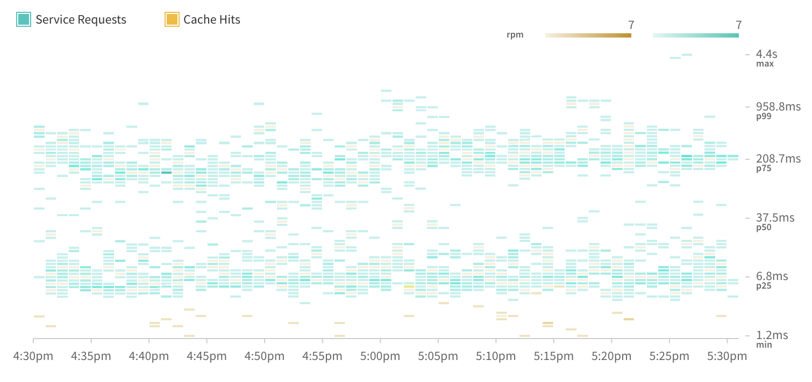
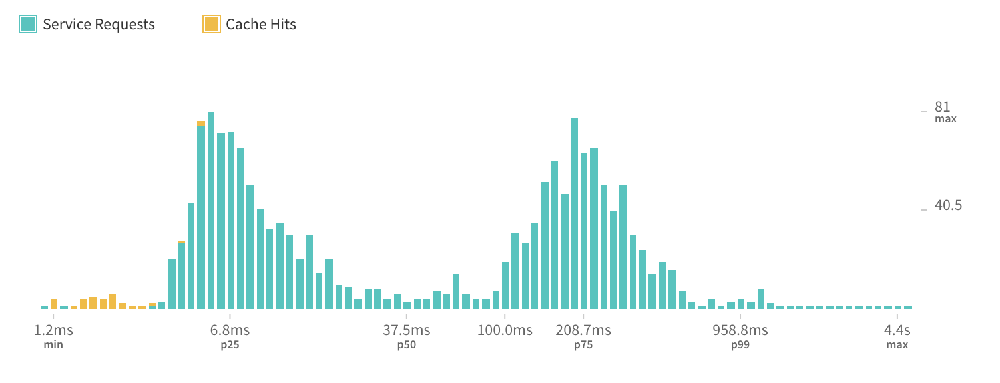

One of the most powerful Engine features is the ability to get fine-grained understanding of the performance of your GraphQL execution. Without GraphQL, performance is often tracked on a per-endpoint basis, but now that your data is accessed through GraphQL queries, that approach isn't as effective.

Engine's performance features are focused around two main concepts:

1.  GraphQL operations (queries and mutations)
2.  Fields and resolvers

Performance analytics can be found on the _Metrics_ section of an [Apollo Engine](https://engine.apollographql.com/) service.

<h2 id="configuration">Configuration</h2>

To configure Apollo Server to send performance metrics to Apollo Engine, follow the steps in the [Apollo Server metrics guide](/docs/apollo-server/features/metrics.html).

For non-Node.js GraphQL servers, Apollo offers the Apollo Engine Proxy which relays performance tracing data to the Apollo Engine service.  For more information on this technique, see the [non-Node.js server setup guide](/docs/engine/setup-standalone.html).

Once performance metrics are enabled on a GraphQL server, visit the _Metrics_ tab of the appropriate Apollo Engine service to view in-depth performance data.

<h2 id="charts">Charts</h2>

Once you're on the Metrics page, you can filter performance data by operation or view the data based on all your aggregate operations. You'll see three main charts that we've selected based on conversations with GraphQL developers to display the most important data you need to know about your server's performance.

<h3 id="volume">Volume chart</h3>

This chart shows request and cache volume in requests per minute (RPM) over time.

<h3 id="heat-map">Heat map</h3>

This chart shows every GraphQL operation from your clients in your selected time range. The horizontal axis is time, and the vertical axis shows how long the operation took. Faster response times are at the bottom, slower at the top. Darker colors represent larger request volume. This chart shares a horizontal axis with the volume chart above it.

To read more about the ideas behind this chart, check out [the blog post where it was originally introduced](https://dev-blog.apollodata.com/new-in-optics-trends-over-time-3665692de2c7).

<h3 id="histogram">Histogram</h3>

This chart shows a distribution of how long every GraphQL operation took in your selected time range. The horizontal axis shows how long the operation took, and the height of the bars reflect how many requests fell into each duration range. Every bar represents the sum of a row in the heatmap chart above.

