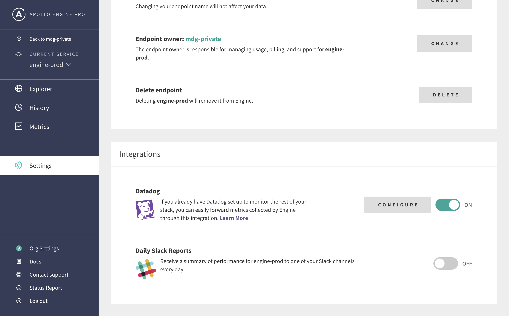

With Engine, you can get a birds-eye view of your GraphQL API delivered on a daily basis to the Slack channel of your choice. Here's what an Engine Slack report looks like:

In this docs page, we'll go over how to set up reports for a service in Engine, and how to use some of the data presented in the report.

<h2 id="setup">Setting up reports</h2>

First, go to the _Settings_ page of your service, then scroll down to the _Integrations_ section.  Next, enabled the toggle switch next to _Daily Slack Reports_.

After enabling _Daily Slack Reports_, you'll see a pop-up like below:

Now, let's follow the directions in the pop-up to set up a service.

1.  Visit the [Incoming Webhooks app](https://my.slack.com/services/new/incoming-webhook/) for your team.
2.  Select the channel you want Engine to post to.
3.  Click "Add Incoming Webhooks Integration".
4.  Copy the "Webhook URL" on the next screen.
5.  Paste it into the "Slack Webhook URL" field in the form in the Engine UI.
6.  Click "Update".

At this point, you should receive a confirmation message from Engine in the Slack channel you selected, that looks much like this:

After confirmation, the first report should appear up in the configured Slack channel within 24 hours, and additional reports should be delivered each day at 9am Pacific time.

> If you don't receive the confirmation or the report doesn't show up after 24 hours, please reach out to <a href="javascript:void(0);" onclick="Intercom('showNewMessage')">support</a> so we can help you get things set up!

<h2 id="usage">Using the report</h2>

We've constructed the report provided to give you an actionable summary of what's happened in your API in the last 24 hours. Here’s how you can use it to identify issues:

1.  **Request rate:** This shows you how many queries are hitting your server every minute, along with a list of the most popular operations. If you see a huge dip in this and it's usually a busy time for your app, it might mean that queries aren’t able to reach your server, or some client is down.
2.  **p95 service time:** This shows you how long queries are taking to execute. We selected p95 since it’s the best overall representation of how your users are experiencing your app. You can use this to identify that your API is overloaded and users are seeing long loading delays, or to find out which queries are taking the longest to run. This is usually directly connected to UI performance, so a 500ms query probably means some part of your UI is taking that long to display.
3.  **Error percentage:** This will show you how many of your GraphQL requests end up with an error result. Spikes in errors might be the result of some underlying backend malfunctioning. You can also see which of your operations are most error-prone.

<h3 id="click-operation">Getting operation details</h3>

Each operation that appears in the report is a link, so you can get right from the report in Slack to the relevant view in Engine to get more details about the issue. For example, you might want to look at the [trace view](./query-tracking.html) to debug a performance problem, or the [error page](./error-tracking.html) to get the message and reproduction info for a common error.
