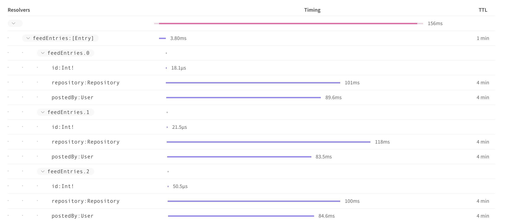
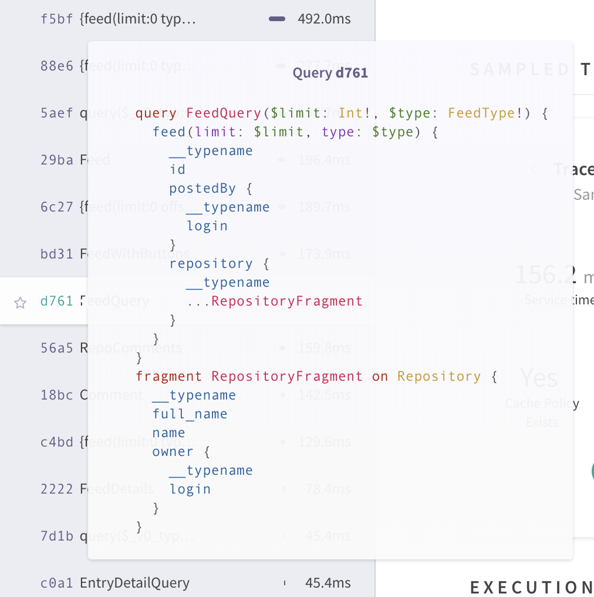

The first feature of Engine, and one of the most commonly used, is the ability to get fine-grained understanding of the performance of your GraphQL execution. Without GraphQL, performance is often tracked on a per-endpoint basis, but now that your data is accessed through GraphQL queries that approach isn't as effective.

Engine's performance features are focused around two main concepts:

1. GraphQL operations (queries and mutations)
2. Fields and resolvers

Engine automatically hooks into your GraphQL execution using the open Apollo Tracing standard supported by many GraphQL servers, allowing you to get lots of useful data out of the box with no application-specific configuration.

<h2 id="charts">Charts</h2>

Once you select an operation in the Engine UI, you'll see three main charts. We've selected these based on conversations with GraphQL developers to display the most important data you need to know about your server's performance.

<h3 id="volume">Volume chart</h3>

This chart shows request and error volume in requests per minute (RPM) over time.

<h3 id="heat-map">Heat map</h3>

This chart shows every GraphQL operation from your clients in your selected time range. The horizontal axis is time, and the vertical axis shows how long the operation took. Faster response times are at the bottom, slower at the top. Darker colors represent larger request volume. This chart shares a horizontal axis with the volume chart above it.

To read more about the ideas behind this chart, check out [the blog post where it was originally introduced](https://dev-blog.apollodata.com/new-in-optics-trends-over-time-3665692de2c7).

<h3 id="histogram">Histogram</h3>

This chart shows a distribution of how long every GraphQL operation took in your selected time range. The horizontal axis shows how long the operation took, and the height of the bars reflect how many requests fell into each duration range. Every bar represents the sum of a row in the heatmap chart above.

<h2 id="trace">Trace view</h2>

Execution of a GraphQL query happens layer by layer, and each field in the query calls a function in your server called a resolver. The Trace view in the Engine UI allows you to look at a detailed breakdown of the execution of one query, with timing for every resolver.

The full query associated with the trace can be viewed by clicking on the "operation" tab at the top of the page. In this case, the full query looks like this:

If you want to read about the design decisions behind the Trace view in Engine in depth, check out the [excellent blog post from Danielle Man](https://dev-blog.apollodata.com/the-new-trace-view-in-apollo-engine-566b25bdfdb0), one of the engineers that built it.

<h3 id="available-traces">Available traces</h3>

At the top of the Trace view, right under the timing histogram, you can see a line with dots on it, where each dot matches up with a bucket in the histogram. This allows you to look at a sample trace for a particular request duration. For example, if you want to see a trace of a particularly slow execution of this query, you can click on one of the dots further on the right.

<h3 id="critical-path">Critical path</h3>

When you first open the trace view, some of the fields are collapsed and some are open. It's not random; in fact the default view is showing you a very helpful piece of information which is the "critical path" of the query. This is the set of fields and resolvers which is the longest sequence in the query. Therefore, if you are trying to speed up your execution this is the set of fields you should probably look into first.

<h3 id="expanding">Expanding fields</h3>

Some of the fields have a gray oval around them. These are fields that can be expanded and collapsed to see additional fields underneath them. A GraphQL query is a tree, so we display the performance information in the same way. We actually keep track of the relationships between the fields, so you can have a GraphQL-centric understanding of your performance that you wouldn't get from a generic tracing tool.
