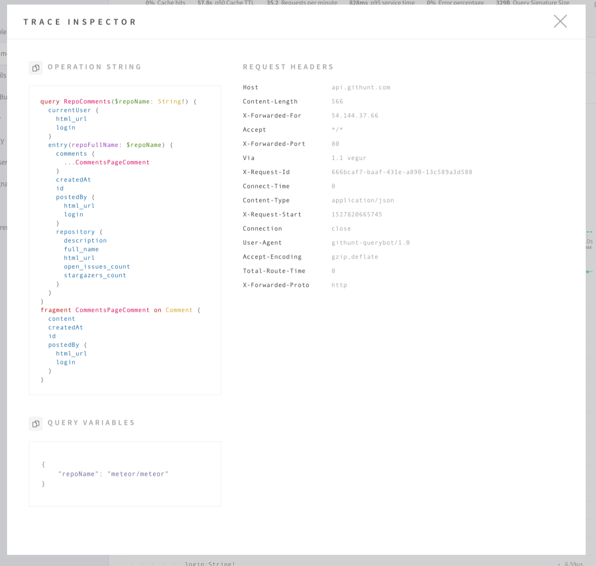

Engine tracks all queries that clients send to your GraphQL API.  We often prefer to call these "operations", a term that includes both GraphQL queries and mutations.  The execution timing of individual operations and fields is always aggregated into statistics that are sent to Engine (see [Performance Tracing](performance.html)), and sometimes additional detail is included.

<h2 id="sampled-traces">Sampled Traces</h2>
When Engine deems that a particular sample is interesting enough to be recorded as a full [Trace](performance.html#trace), the complete resolver timings, individual variables, and HTTP request headers are captured and stored by Engine as well.  These traces can be incredibly useful to understand specific examples of queries that have been run on your GraphQL API.  Using the Trace Inspector, you can see the operation string that was sent, along with the variables and headers that were collected by Engine for this trace:



<h2 id="operation-signatures">Operation Signatures</h2>

Engine tracks operation strings in a normalized "signature" form, which might look a little bit different than the full operation string that your clients send. These signatures are generated in real-time as the proxy is handling GraphQL traffic, and include additional transforms that help with doing statistical aggregation of operations that have the same basic shape.

<h3 id="transformations">Transformations</h3>
The following transformations may be performed when generating a signature:

- Input argument values are mapped according to the following rules:
  - `Variable`, `BooleanValue`, `EnumValue` preserved
  - `IntValue` and `FloatValue` replaced by `0`
  - `StringValue` replaced by `""`
  - `ListValue` replaced by `[]`
  - `ObjectValue` replaced by `{}`
- [Ignored tokens](http://facebook.github.io/graphql/draft/#sec-Source-Text.Ignored-Tokens) are removed, including redundant `WhiteSpace`. Single spaces are only preserved when required for parsing the request.
- Only the `OperationDefinition` corresponding to the requested operation and reachable `FragmentDefinition`s are included.
  The operation appears first, fragment definitions appear in order of first reachability when traversing spread-first, depth-second.
- `Alias`es are removed.
- In `SelectionSet`, fields appear before fragment spreads, fragment spreads appear before inline fragments.
- Otherwise, elements are sorted by name alphanumerically, including `Argument` and `Directive`.
- Otherwise, elements are kept in order. For example in `{north:neigh(dir:NORTH) east:neigh(dir:EAST)}`, `EAST` should always appear after `NORTH`.

For example:

```
query Foo {
  user(id : "hello") {
    ... Baz
    timezone
    aliased: name
  }
}
fragment Baz on User {
  dob
}
```

becomes

```
query Foo{user(id:""){name timezone...Baz}}fragment Baz on User{dob}
```

> A reference implementation of query signatures is available [here](https://github.com/apollographql/optics-agent/blob/master/reference/QuerySignatures.kt).

These transformations make it possible to aggregate statistics about how your API is being used.  It also happens that normalizing away the argument values is a means to achieve greater data privacy within Engine, however the primary goal is to better identify queries that have an equivalent field structure.  Where possible, we strongly advise that you keep sensitive data in variables (instead of in literal arguments in the query body), as you can more easily control which variables should be stripped out of the Engine reporting pathway for privacy purposes.  See [Data Privacy]('data-privacy.html) for further detail on how this works.

<h2 id="tracking-subs">A Note on GraphQL Subscriptions</h2>

Engine does not currently track statistics or traces for subscriptions.  The proxy does, however, support the transparent pass-through of subscription requests and responses.
