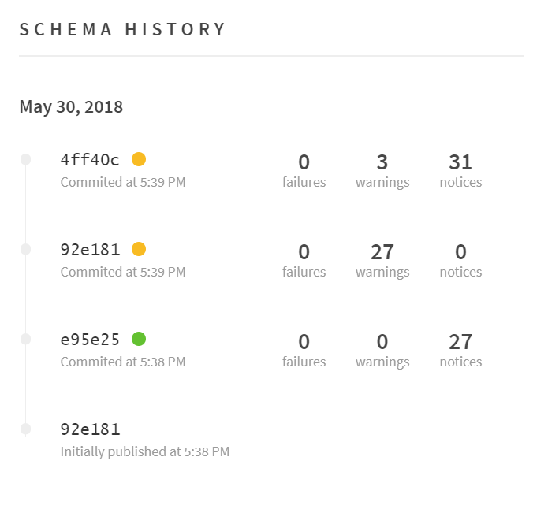
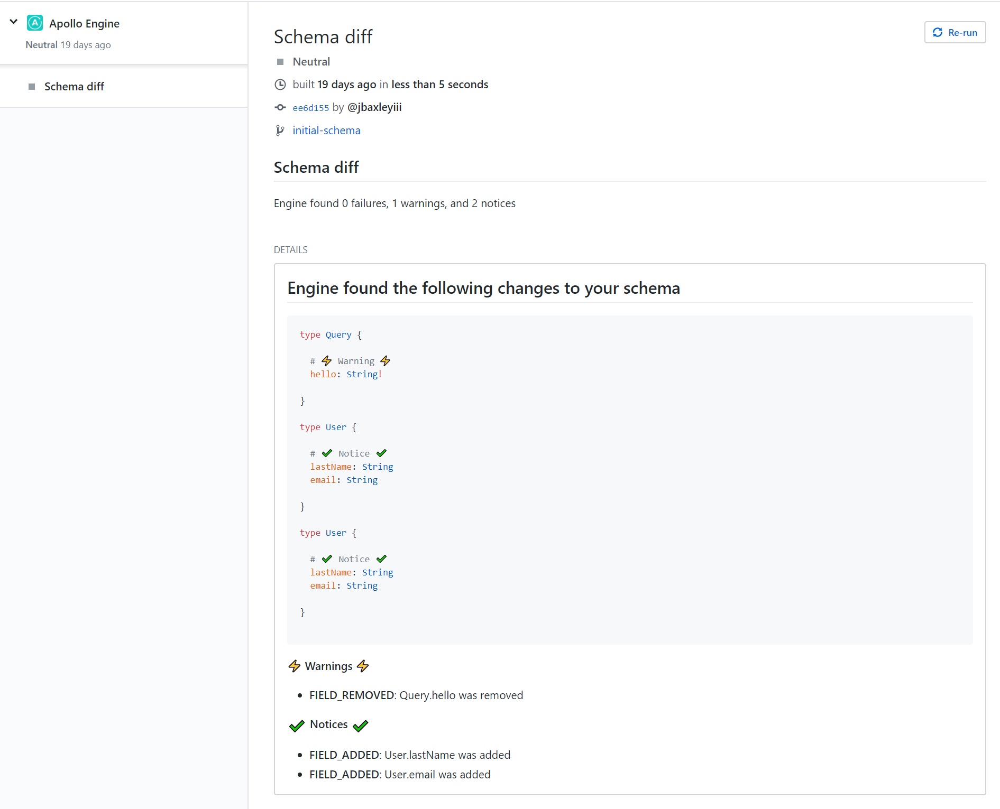

GraphQL makes evolving an API much easier than it used to be with REST. As the demands of a client change, types, fields, and arguments can be added and removed without breaking the previous consumers of the API.  In order to do this safely, it is critical to know how current clients are using the schema.

Apollo Engine's schema history allows developers to confidently iterate a GraphQL schema by validating the new schema against field-level usage data from the previous schema.  By knowing exactly which clients will be broken by a new schema, developers can avoid inadvertently deploying a breaking change.

In addition to avoiding breaking changes, schema history allows developers to trace schema changes back to the original commit and find what else it may have been associated with.

For more information and best practices about iterating a GraphQL endpoint over time, check out the in-depth [versioning guide](https://www.apollographql.com/docs/guides/versioning.html).


<h2 id="setup">Setup</h2>

To begin using schema history, a schema is published to Apollo Engine using the `apollo` command line interface (CLI).  This is best accomplished from automatic steps within a continuous integration workflow and an example CircleCI configuration is available below.

Each time a schema is published, it becomes the basis for comparison for validating future schemata and avoiding breaking changes.  Therefore, a schema should be re-published to Apollo Engine each time a new schema is deployed.

The `apollo` command helps facilitate the publishing and updating of schema within Apollo Engine.  To configure it, follow the steps below!

<h3 id="install-apollo-cli">Install Apollo CLI</h3>

To install the `apollo` CLI, ensure that `node` and `npm` are installed, then run:

```bash
npm install --global apollo
```

> Note: This guide will utilize the global installation method, but the `apollo` command can also be installed in a project's `devDependencies` and used via [`npm-scripts`](https://docs.npmjs.com/misc/scripts) or [`npx`](https://npm.im/npx).

<h3 id="publish-schema">Publish schema</h3>

Once the `apollo` command is installed, the `apollo schema:publish` command is used to publish a schema to Apollo Engine.

To publish a schema, start the GraphQL server and run the following command, substituting the appropriate GraphQL endpoint URL and an API key:

> An API key can be obtained from a service's _Settings_ menu within the [Apollo Engine dashboard](https://engine.apollographql.com/).

```bash
apollo schema:publish --key="<API_KEY>" --endpoint="https://example.com/graphql"
```

> For accuracy, it's best to retrieve the schema from a running GraphQL server (with introspection enabled), though the `--endpoint` can also reference a local file.  See [schema sources](#schema-sources) for more information.

<h2 id="history">Version history</h2>

As your schema grows and evolves to meet the needs of your product, it is helpful to see a history of changes for a team. This allows everyone to know when new features were introduced, when old fields were removed, and even link back to the commit that caused the change. Apollo Engine provides all the tooling needed to track this history in a simple way. Every time your schema is updated, you can simply run the [publish](#publish-schema) command again to keep an up to date history of your schema.



<h2 id="schema-validation">Schema validation</h2>

A GraphQL schema can change in a number of ways between releases and, depending on the type of change, can affect clients in a variety of ways. Since changes can range from "decidedly safe" to "certain breakage", it's helpful to use schema tools which are aware of actual API usage.

By comparing a new schema to the last published schema, Apollo Engine can highlight points of concern by showing detailed schema changes alongside current usage information for those fields.  With this pairing of data, the risks of changes can be greatly reduced.

To check and see the difference between the current published schema and a new version, run the following command, substituting the appropriate GraphQL endpoint URL and an API key:

> An API key can be obtained from a service's _Settings_ menu within the [Apollo Engine dashboard](https://engine.apollographql.com/).

```bash
apollo schema:check --key="<API_KEY>" --endpoint="http://localhost:4000/graphql"
```

> For accuracy, it's best to retrieve the schema from a running GraphQL server (with introspection enabled), though the `--endpoint` can also reference a local file.  See [schema sources](#schema-sources) for more information.

After analyzing the changes against current usage metrics, Apollo Engine will identify three categories of changes and report them to the developer on the command line or within a GitHub pull-request:

1. **Failure**: Either the schema is invalid or the changes _will_ break current clients.
2. **Warning**: There are potential problems that may come from this change, but no clients are immediately impacted.
3. **Notice**: This change is safe and will not break current clients.

The more [performance metrics](./performance.html) that Apollo Engine has, the better the report of these changes will become.


<h2 id="github">GitHub Integration</h2>


Schema validation is best used when integrated in a team's development workflow. To make this easy, Apollo Engine integrates with GitHub to provide status checks on pull requests when schema changes are proposed. To enable schema validation in GitHub, follow these steps:

<h3 id="install-github">Install GitHub application</h3>

Go to [https://github.com/apps/apollo-engine](https://github.com/apps/apollo-engine) and click the `Configure` button to install the Apollo Engine integration on the appropriate GitHub profile or organization.

<h3 id="check-schema-on-ci">Run validation on each commit</h3>

By enabling schema validation in a continuous integration workflow (e.g. CircleCI, etc.), validation can be performed automatically and potential problems can be displayed directly on a pull-request's status checks — providing feedback to developers where they can appreciate it the most.

To run the validation command, the GraphQL server must have introspection enabled and run the `apollo schema:check` command.  For more information, see [schema validation](#schema-validation) or see the configuration recommendations below.



<h3 id="publish-on-deploy">Publish to Apollo Engine after deploying</h3>

In order to keep provide accurate analysis of breaking changes, it important to run the `apollo schema:publish` command each time the schema is deployed. This can be done by configuring continuous integration to run `apollo schema:publish` automatically on the `master` branch (or the appropriate mainline branch).

Below is a sample configuration for validation and publishing using CircleCI:

```yaml
version: 2

jobs:
  build:
    docker:
      - image: circleci/node:8

    steps:
      - checkout

      - run: npm install
      # CircleCI needs global installs to be sudo
      - run: sudo npm install --global apollo

      # Start the GraphQL server.  If a different command is used to
      # start the server, use it in place of `npm start` here.
      - run:
          name: Starting server
          command: npm start
          background: true

      # make sure the server has enough time to start up before running
      # commands against it
      - run: sleep 5

      # This will authenticate using the `ENGINE_API_KEY` environment
      # variable. If the GraphQL server is available elsewhere than
      # http://localhost:4000/graphql, set it with `--endpoint=<URL>`.
      - run: apollo schema:check

      # When running on the 'master' branch, publish the latest version
      # of the schema to Apollo Engine.
      - run: |
          if [ "${CIRCLE_BRANCH}" == "master" ]; then
            apollo schema:publish
          fi
```


<h2 id="cli-commands">CLI usage</h2>

* [`apollo help [COMMAND]`](#cli-help)
* [`apollo schema:check`](#cli-schema-check)
* [`apollo schema:publish`](#cli-schema-publish)

<h3 id="cli-help">`apollo help [COMMAND]`</h3>

Display help for the Apollo CLI:

```
USAGE
  $ apollo help [COMMAND]

ARGUMENTS
  COMMAND  command to show help for

OPTIONS
  --all  see all commands in CLI
```

<h3 id="cli-schema-check">`apollo schema:check`</h3>

Check a schema against the version registered in Apollo Engine.

```
USAGE
  $ apollo schema:check

OPTIONS
  -h, --help               Show command help
  --endpoint=endpoint      [default: http://localhost:4000/graphql] The URL of the server to fetch the schema from
  --header=header          Additional headers to send to server for introspectionQuery
  --json                   Output result as JSON
  --key=key                The API key for the Apollo Engine service
```

<h3 id="cli-schema-publish">`apollo schema:publish`</h3>

Publish a schema to Apollo Engine

```
USAGE
  $ apollo schema:publish

OPTIONS
  -h, --help               Show command help
  -e, --endpoint=endpoint  [default: http://localhost:4000/graphql] The URL of the server to fetch the schema from
  --header=header          Additional headers to send to server for introspectionQuery
  --json                   Output successful publish result as JSON
  --key=key                The API key for the Apollo Engine service
```

<h3 id="schema-sources">Schema sources</h3>

The source of a schema is specified by using the `--endpoint` flag to the `apollo schema:*` commands.  Typically, this should be set to the URL of a running GraphQL server (e.g. `--endpoint=https://localhost:4000/graphql`).

Using a GraphQL server that is currently running is recommended since it can be quickly tested against during development and, since it's running against the most recent code, avoids the possibility that a statically output schema file is outdated:

For cases where running the GraphQL server _isn't_ possible, the  `--endpoint` may also refer to a local file, either:

1. A `.json` file with the introspection query result. (e.g. `--endpoint=schema.json`)
2. A file with the schema in the GraphQL schema definition language (SDL). (e.g. `--endpoint=schema.txt`)
